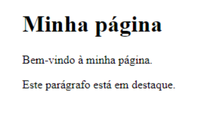
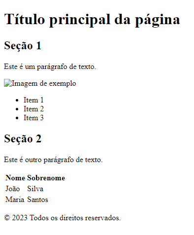

# [Aprendendo Html](https://docs.google.com/presentation/d/1UqT0jXbwCmHnexhsiOe8PccYZkbgJ6hepK4zqSLSStg/edit?usp=sharing)


## O que é HTML?
É o bloco de construção mais básico da web. Define o significado e a estrutura do conteúdo da web. Outras tecnologias além do HTML geralmente são usadas para descrever a aparência/apresentação (CSS) ou a funcionalidade/comportamento (JavaScript) de uma página da web.
Para utilizarmos esta “Linguagem de marcação de Hipertexto”, vamos usar um editor de código, que funciona como um editor de texto, porém ele ajuda visualmente “nos programadores” a visualizar melhor o documento, a ferramenta será usada e o visual studio code.

Versão online: https://vscode.dev/ |Também é possível baixar a ferramenta.

# Conceitos básicos do HTML:

### Estrutura básica de uma página HTML
Toda página HTML começa com a tag ``<html>`` e termina com a tag </html>. Dentro dessa estrutura, temos o  ``<head> `` e o  ``<body> ``. O  ``<head> `` contém informações sobre a página, como o título, meta tags e scripts. O  ``<body> `` contém o conteúdo da página, como textos, imagens e outros elementos.

### Tags HTML (< >)
O HTML é composto por uma série de tags que são usadas para definir os elementos da página. As tags são escritas entre os sinais de menor e maior (< e >) e podem ter atributos que são definidos dentro da própria tag.
### Atributos HTML
Os atributos são usados para fornecer informações adicionais para as tags HTML. Eles são escritos dentro das tags e são definidos pelo nome do atributo e seu valor. Por exemplo, a tag  `` `` tem um atributo chamado "src" que define o caminho da imagem a ser exibida na página. (exemplo:  `` ``)

## The HTML DOM Tree of Objects


## Exercício 1: estrutura HTML
Para o primeiro exercicio de html temos uma estrutura basica de html, onde temos o head e o body, dentro do head temos o a tag``<title>``, que é o titulo da pagina, e dentro do body temos o ``<h1>``, que é o titulo da pagina, e o ``<p>``, que é o paragrafo da pagina.

Para a primeira atividade comente cada linha do código html, e explique o que cada linha faz.

``<!-- Comentário -->``

```html
<!DOCTYPE html>
<html>
<head>
  <title>Minha página</title>
</head>
<body>
  <h1>Minha página</h1>
  <p>Bem-vindo à minha página.</p>
  <p class="destaque">Este parágrafo está em destaque.</p>
</body>
</html>
```
Resultado: 



## Exercício 2: Tags HTML
Para o segundo exercio usaremos mais alguma tags em html, para saber mais sobre essas tags acesse o link: https://www.w3schools.com/tags/default.asp ou [conteudo no github sobre tags](https://github.com/Pquar/PROJETOS-COM-HTML_CSS_JAVASCRIPT/tree/master/APRENDENDO%20html/exercicio%202%20(Tags))

Comente cada linha do código html, e explique o que cada linha faz.
``<!-- Comentário -->``

```html
<!DOCTYPE html>
<html>
<head>
	<title>Exemplo de página HTML</title>
</head>
<body>
	<header>
		<h1>Título principal da página</h1>
	</header>
	<main>
		<section>
			<h2>Seção 1</h2>
			<p>Este é um parágrafo de texto.</p>
			
			<ul>
				<li>Item 1</li>
				<li>Item 2</li>
				<li>Item 3</li>
			</ul>
		</section>
		<section>
			<h2>Seção 2</h2>
			<p>Este é outro parágrafo de texto.</p>
			<table>
				<tr>
					<th>Nome</th>
					<th>Sobrenome</th>
				</tr>
				<tr>
					<td>João</td>
					<td>Silva</td>
				</tr>
				<tr>
					<td>Maria</td>
					<td>Santos</td>
				</tr>
			</table>
		</section>
	</main>
	<footer>
		<p>© 2023 Todos os direitos reservados.</p>
	</footer>
</body>
</html>

```
Resultado:




## Praticando HTML

Iremos praticar mais html ao longo da jornada, porem agora com css, proxima para modulo 02 aprendendo com css.