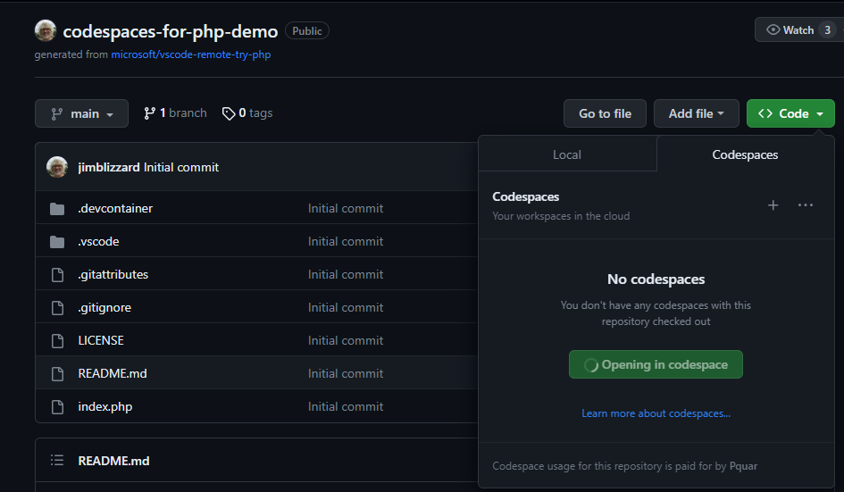
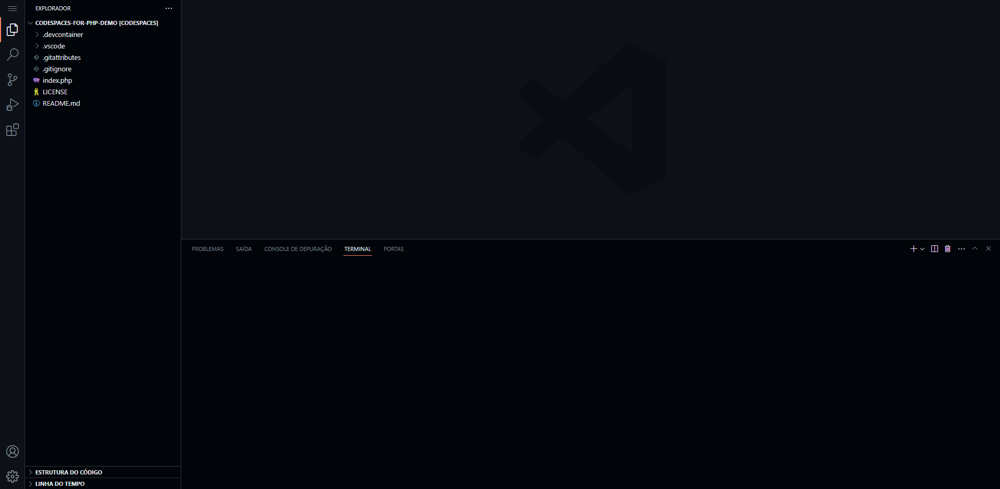

# Como rodar o PHP
Para rodar o PHP, você precisa ter o PHP instalado na sua máquina. Para isso, você pode seguir o tutorial do [site oficial](https://www.php.net/manual/pt_BR/install.php).
ou usar pelo codespaces do github.
Entre no repositório de [demo do php](https://github.com/jimblizzard/codespaces-for-php-demo), clique em open em codespace como na imagem abaixo:

Apos isso ira Abrir o codespace "e um computador em nuvem para voce". ultilizar.

Para iniciar uma server com php, abra o terminal e digite o comando:
```bash
php -S localhost:8000
```
se não conseguir abrir o localhost, tente abrir com o ip da maquina, para isso digite o comando:
```bash
php -S 0000:8000
```
assim ira abrir o servidor na porta 8000, para acessar o servidor, abra o navegador e digite localhost:8000 ou 0000:8000.